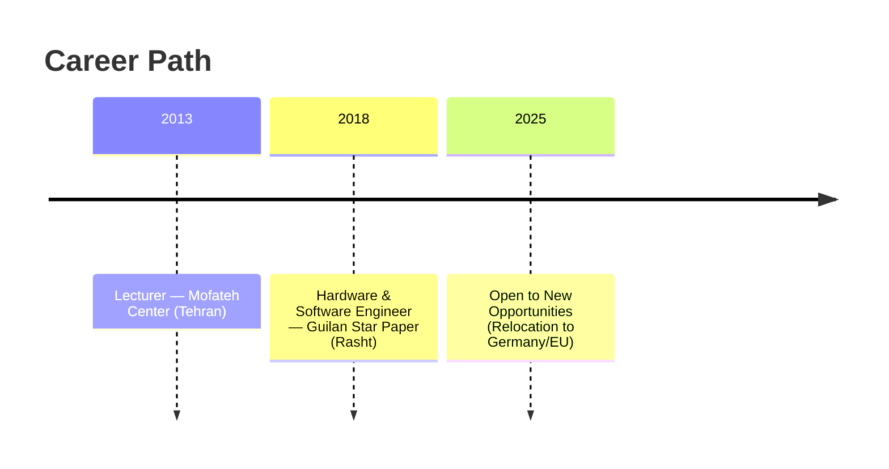

  

# Embedded Systems & Hardware/Software Engineer

**Location:** Iran — *Open to relocation (Germany/EU)*  
**Email:** Ali.alijani198989@gmail.com  
**LinkedIn:** https://www.linkedin.com/in/ali-alijani-lashkaryani

---

## Profile
Embedded engineer with **6+ years** experience in **microcontroller firmware (ARM/STM32, AVR, ESP32)**, **embedded C** (MISRA-aware), **RTOS (FreeRTOS)**, and **PCB design** (Altium Designer). Hands-on with **SPI, I²C, UART, CAN, Ethernet, MQTT**, debugging via **JTAG/SWD/GDB**, and EMC/EMV considerations (incl. **IPC-610** workmanship awareness). Comfortable taking a concept from schematic/PCB through firmware, bring-up, test, and field deployment.

---

## Core Skills
- **Firmware:** Embedded C (MISRA), drivers, HAL/LL, low-power, bootloaders, FOTA (familiar)  
- **MCUs/Platforms:** **STM32**, **AVR**, **ESP32**; basics: ARM Cortex-M tools  
- **RTOS/SDKs:** **FreeRTOS**, STM32CubeMX/IDE, ESP-IDF, PlatformIO  
- **Connectivity & Protocols:** **SPI, I²C, UART, CAN, Ethernet, MQTT**, BLE/Wi-Fi (ESP8266/ESP32)  
- **Hardware/PCB:** **Altium Designer**, multilayer routing, signal integrity basics, DFM  
- **Debug/Tools:** **JTAG/SWD, GDB**, Keil uVision, STM32CubeIDE, Atmel Studio, VS Code, Git

---

## Experience
**Guilan Star Papier — Software & Hardware Developer** *(Rasht, Apr 2018 – Present)*  
- Developed embedded firmware in **Embedded C**; integrated **CAN/SPI/I²C/UART** across products.  
- Designed/updated PCBs in **Altium Designer** for **STM32/AVR/ESP32**-based boards; factory adaptation.  
- Built **wireless control** for household devices using **HC-05**, SPI/I²C peripherals, **UART** command set, and security measures.  
- Implemented an **industrial charger on FPGA (Spartan-6, VHDL)**; optimized charging strategy.  
- Applied **EMC/EMV** practices; consulted on requirements, diagnostics, and circuit optimization.

**Mofteh Center — Lecturer (Electronics, Robotics, AVR/ARM, Altium/Proteus)** *(Tehran, Sep 2013 – Jun 2016)*  
- Delivered hands-on courses using **Arduino, ARM MCUs, Altium, Proteus** aligned to industry skills.

---

## Selected Projects
- **STM32 + FreeRTOS task scheduling** with peripheral drivers and ISR design.  
- **ESP32 IoT sensor node & dashboard** (Wi-Fi/MQTT, remote telemetry, data logging).  
- **High-speed multi-layer PCB** with SI/EMC-aware routing in **Altium Designer**.  
- **FPGA-based industrial charger** (Spartan-6, **VHDL**).

---

## Education
- **B.Sc. Electronics Technology Engineering** — Azad University, Tehran South (2016–2019)  
- **Associate in Electronics** — Enqelabe Eslami Technical Faculty, Tehran (2010–2013)

---

## Certificates
- **PCB Design with Altium Designer** (2020)  
- **Design & Analysis of ARM Microcontroller Circuits** (2020)  
- **Embedded C** (2012)

---

## Languages
-  Professional working proficiency  
-  Upper intermediate  
-  Native speaker

---

## Publication
- Author of a book that explains the fundamentals of electronics in a simple way.

---

## Career Timeline

  
  

  

