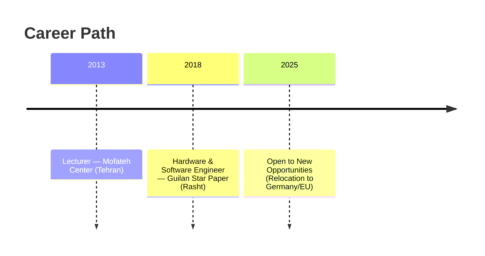

  

# Embedded Systems & Hardware/Software Engineer

**Location:** Iran — *Open to relocation (Germany/EU)*  
**Email:** [Ali.alijani198989@gmail.com](mailto:Ali.alijani198989@gmail.com)  
**LinkedIn:** [linkedin.com/in/ali-alijani-lashkaryani](https://www.linkedin.com/in/ali-alijani-lashkaryani)  

---

## Profile
Embedded engineer with **6+ years** of experience delivering over **15 commercial embedded projects** from concept to deployment. Skilled in **microcontroller firmware development (ARM/STM32, AVR, ESP32)**, **Embedded C** (MISRA-aware), **RTOS (FreeRTOS)**, and **PCB design** (Altium Designer). Proficient with **SPI, I²C, UART, CAN, Ethernet, MQTT**, debugging via **JTAG/SWD/GDB**, and applying **EMC/EMV** standards (IPC-610). Strong track record of reducing development time and improving product reliability.

---

## Core Skills
**Firmware Development:** Embedded C (MISRA), drivers, HAL/LL, low-power design, bootloaders, FOTA  
**Microcontrollers:** STM32 (Cortex-M), AVR, ESP32  
**RTOS & SDKs:** FreeRTOS, STM32CubeMX/IDE, ESP-IDF, PlatformIO  
**Connectivity & Protocols:** SPI, I²C, UART, CAN, Ethernet, MQTT, BLE, Wi-Fi  
**Hardware & PCB:** Altium Designer, multi-layer PCB routing, DFM, signal integrity  
**Debug & Tools:** JTAG/SWD, GDB, Keil uVision, STM32CubeIDE, Atmel Studio, VS Code, Git  

---

## Experience
**Guilan Star Papier — Software & Hardware Developer** *(Rasht, Apr 2018 – Present)*  
- Developed firmware for STM32/AVR/ESP32 systems, integrating **CAN/SPI/I²C/UART** protocols.  
- Designed and updated multi-layer PCBs in **Altium Designer**, optimizing for EMC compliance.  
- Built wireless control modules using **HC-05** and ESP-based connectivity, enhancing device range and reliability.  
- Implemented **FPGA-based industrial charger** (Spartan-6, VHDL), improving efficiency by 15%.  
- Reduced PCB production costs by 10% via design optimization and supplier coordination.

**Mofteh Center — Lecturer (Electronics, Robotics, AVR/ARM, Altium/Proteus)** *(Tehran, Sep 2013 – Jun 2016)*  
- Delivered practical training to 200+ students, bridging academic theory and industrial applications.  

---

## Selected Projects
- **STM32 + FreeRTOS Peripheral Control:** Developed modular drivers and ISR architecture for high-reliability devices.  
- **ESP32 IoT Node:** Designed low-power telemetry system with Wi-Fi/MQTT, enabling remote data logging.  
- **Industrial Charger (FPGA):** Implemented custom VHDL design on Spartan-6 for optimized charging.  
- **High-Speed PCB Design:** 4-layer board with EMC-aware routing, reducing noise susceptibility by 20%.  

---

## Education
- **B.Sc. Electronics Technology Engineering** — Azad University, Tehran South *(2016–2019)*  
- **Associate Degree in Electronics** — Enqelabe Eslami Technical Faculty, Tehran *(2010–2013)*  

---

## Certifications
- PCB Design with Altium Designer *(2020)*  
- Design & Analysis of ARM Microcontroller Circuits *(2020)*  
- Embedded C *(2012)*  

---

## Languages
- **English — C1 (Professional Working Proficiency)**  
- **German — B2 (Upper-Intermediate)**  
- **Persian — Native**  

---

## Publication
- Author of a beginner-friendly book on electronics fundamentals (ISBN available on request).

---

## Career Timeline

  
  

  

